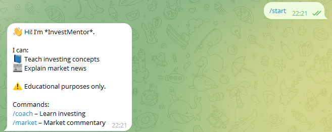

# InvestMentor – Investment Coach & Market Commentary Assistant

InvestMentor is an educational, chat-based assistant designed to help users:
- Learn investing concepts from beginner to intermediate level
- Understand daily market movements through neutral commentary

⚠️ **Disclaimer:**  
This project is for **educational purposes only**. It does **not** provide investment advice, buy/sell recommendations, stock tips, or personalized financial guidance.

---

## 🔗 Live Telegram Bot

You can interact with the live version of the bot on Telegram:

👉 **Telegram Handle:** [@vinitinvestmentor_bot](https://t.me/vinitinvestmentor_bot)

The bot supports:
- Investment Coach mode for learning core concepts
- Market Commentary mode for neutral market explanations
- Safe refusal and redirection for investment advice requests

---

## ✨ Features

### 📘 Investment Coach Mode
- Explains investing concepts (SIP, risk, diversification, ETFs, etc.)
- Uses simple real-life analogies and frameworks
- Designed for beginners and intermediate learners
- Strictly avoids recommendations, predictions, or returns

### 📰 Market Commentary Mode
- Provides neutral explanations for market movements
- Covers macroeconomic factors, global cues, and news context
- No forecasts, targets, or trading suggestions

### 🛡️ Safety & Compliance (Core Focus)
- Explicit refusal for:
  - Stock recommendations
  - Buy/sell advice
  - Intraday tips
  - Guaranteed return requests
- Unsafe requests are redirected toward educational explanations
- Safety is enforced at the **application layer**, not delegated to the LLM

---

## 🤖 Platform

- Telegram Bot interface
- Deployed using free-tier infrastructure
- Designed as a coach/commentator, **not an advisor**

---

## 🧱 Tech Stack

- **Backend:** FastAPI (Python)
- **LLM:** Google Gemini (`models/gemini-pro`)
- **Messaging:** Telegram Bot API
- **Hosting:** Render (Free Tier)
- **Config Management:** Environment variables (`.env`)

---

## 🧠 Architecture Overview

```text 
User (Telegram)
↓
Telegram Webhook
↓
FastAPI Backend
↓
Safety & Intent Guard
↓
Mode Router (Coach / Market)
↓
Prompt Builder
↓
Google Gemini API
```


---

## 🔐 Environment Variables

Create a `.env` file locally:

```env
GEMINI_API_KEY=your_gemini_api_key_here
TELEGRAM_BOT_TOKEN=your_telegram_bot_token_here

